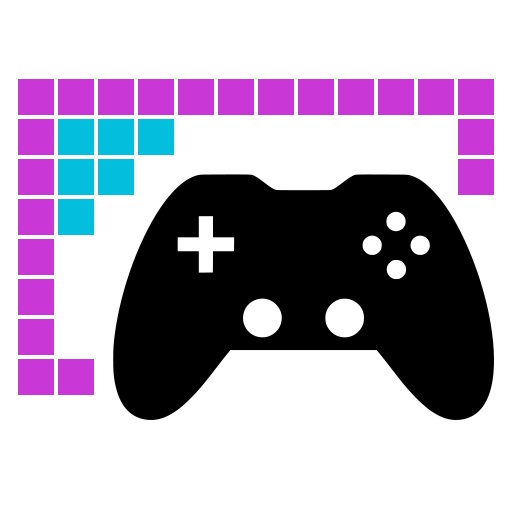

# rlGameCanvas – A pixel-based game graphics framework

> [!IMPORTANT]
> This library is currently WiP and shall not yet be used.

This library acts like a canvas for pixel-based (= bitmap-like graphics) video games.

At this point in time, only Windows is supported.

While the library interface is written to be backwards compatible to older C++ standards, C++20 is
required to compile the library.
